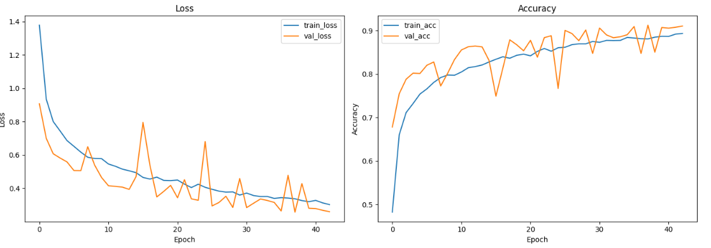
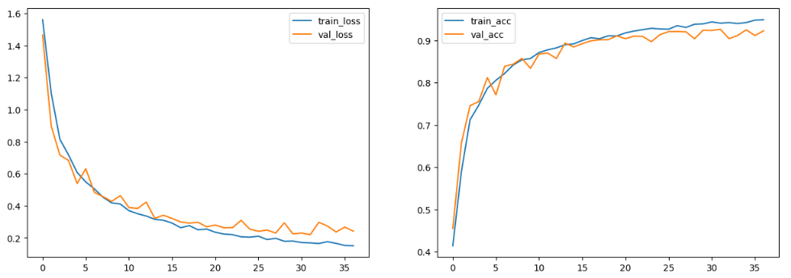
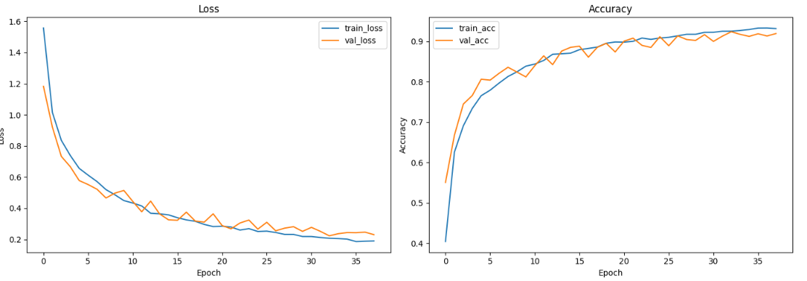

# EuroSAT 위성 이미지 분류 모델 비교

CNN, Vision Transformer(ViT), MLP-Mixer 모델을 활용하여 EuroSAT 위성 이미지 데이터셋의 분류 성능을 비교한 프로젝트입니다.

---

## 프로젝트 소개

딥러닝 기반 이미지 분류 모델들은 서로 다른 방식으로 특징을 추출합니다.

본 프로젝트에서는 위성 이미지 분류 데이터셋인 **EuroSAT**을 사용하여 다음 3가지 모델의 성능을 비교합니다.

- **CNN** — 합성곱 연산 기반의 전통적 이미지 분류 모델
- **Vision Transformer (ViT)** — Self-Attention 기반의 Transformer 모델
- **MLP-Mixer** — Convolution/Attention 없이 MLP만으로 구성된 모델

각 모델의 학습 결과를 비교하고, 정확도 및 손실 그래프를 통해 모델별 특징과 성능 차이를 분석합니다.

---

## 데이터셋 소개

**EuroSAT**은 Sentinel-2 위성 이미지를 기반으로 한 토지 이용/토지 피복 분류 데이터셋입니다.

| 항목 | 내용 |
|------|------|
| 이미지 수 | 27,000장 |
| 클래스 수 | 10개 |
| 이미지 크기 | 64 × 64 픽셀 |
| 채널 | RGB (3채널) |

**10개 클래스:** Annual Crop, Forest, Herbaceous Vegetation, Highway, Industrial, Pasture, Permanent Crop, Residential, River, Sea & Lake

---

## 모델 설명

### 1. CNN

Convolution 연산을 통해 이미지의 지역적 특징을 추출하는 대표적인 이미지 분류 모델입니다.

**특징**
- 이미지의 공간적 지역 패턴을 효과적으로 학습
- 파라미터 공유로 비교적 적은 파라미터 수
- 학습 속도가 빠르고 소규모 데이터에서도 안정적

---

### 2. Vision Transformer (ViT)

이미지를 고정된 크기의 패치로 분할한 후 Transformer 구조를 적용하는 모델입니다.

**특징**
- Self-Attention을 통해 이미지 내 전역적 관계를 학습
- 대규모 데이터셋에서 강력한 성능 발휘
- CNN 대비 귀납적 편향이 적어 데이터가 충분할 때 유리

---

### 3. MLP-Mixer

이미지를 패치 단위로 나눈 후, Token Mixing(패치 간 정보 교환)과 Channel Mixing(채널 간 정보 교환)을 MLP만으로 수행하는 구조입니다.

**특징**
- Convolution과 Self-Attention 없이 순수 MLP로만 구성
- 단순하고 확장성 높은 아키텍처
- 충분한 데이터와 규모에서 ViT에 준하는 성능

---

## 프로젝트 구조

```
eurosat-cnn-vit-mlp/
│
├── notebooks/
│   ├── cnn.ipynb           # CNN 학습 및 평가
│   ├── vit.ipynb           # ViT 학습 및 평가
│   └── mlp_mixer.ipynb     # MLP-Mixer 학습 및 평가
│
├── results/
│   ├── CNN_loss_acc_visualize.PNG
│   ├── ViT_loss_acc_visualize.PNG
│   └── MLP_loss_acc_visualize.PNG
│
└── README.md
```

---

## 실험 결과

### CNN

#### Accuracy & Loss



---

### Vision Transformer (ViT)

#### Accuracy & Loss



---

### MLP-Mixer

#### Accuracy & Loss



---

## 모델 성능 비교

| 모델 | 특징 | 장점 | 단점 |
|------|------|------|------|
| CNN | Convolution 기반 | 빠른 학습 속도, 구현 단순 | 전역 문맥 정보 포착에 한계, 수용 영역이 제한적 |
| ViT | Self-Attention 기반 | 전역 특징 학습, CNN 대비 안정성 증가 | 학습 시간이 김 |
| MLP-Mixer | Token/Channel Mixing | 단순한 구조, Attention 없이도 경쟁력 있는 성능 | 상대적으로 느린 수렴 |

---

## 분석

### CNN

- 세 모델 중 가장 낮은 성능을 기록했습니다.
- Convolution 연산은 지역적 패턴 추출에 강하지만, EuroSAT의 위성 이미지처럼 **전역적 구조**가 중요한 데이터에서는 표현력이 제한될 수 있습니다.
- 학습 속도는 빠르나 안정석으로 수렴하지 못하는 경향이 나타났습니다.
### ViT

- CNN보다 높은 성능을 보이며 중간 순위를 기록했습니다.
- Self-Attention을 통한 전역 문맥 학습이 위성 이미지 분류에 유효함을 확인할 수 있었습니다.
- 다만 EuroSAT 규모에서는 사전 학습 없이 처음부터 학습하는 경우 MLP-Mixer 대비 최적화가 다소 어려운 것으로 나타났습니다.

### MLP-Mixer

- 세 모델 중 가장 높은 성능을 달성했습니다.
- Token Mixing과 Channel Mixing의 조합이 EuroSAT의 64×64 고정 크기 패치 이미지에 적합하게 작동한 것으로 보입니다.
- Convolution이나 Attention 없이도 위성 이미지의 공간적 특징을 충분히 학습할 수 있음을 보여주는 결과입니다.
---

## 결론

본 프로젝트를 통해 동일한 EuroSAT 데이터셋에서 세 가지 아키텍처의 성능을 비교한 결과, MLP-Mixer > ViT > CNN 순으로 높은 정확도를 기록했습니다.

- MLP-Mixer가 가장 우수한 성능을 보인 것은, 고정된 크기의 패치 기반 입력에서 MLP의 단순하고 효과적인 특징 혼합 방식이 EuroSAT 데이터 특성과 잘 맞아떨어진 결과로 해석됩니다.
- ViT는 전역 정보 학습 능력 덕분에 CNN을 상회했으나, 충분한 데이터나 사전 학습이 뒷받침될 때 잠재력이 더욱 발휘될 것으로 기대됩니다.
- CNN은 학습 속도와 구현 단순성 면에서 유리하지만, 이번 실험에서는 전역적 맥락 학습 능력의 한계로 상대적으로 낮은 성능을 보였습니다.

이번 결과는 단순한 구조의 MLP 기반 모델도 적절한 데이터 환경에서는 Attention 기반 모델을 능가할 수 있음을 시사합니다.

